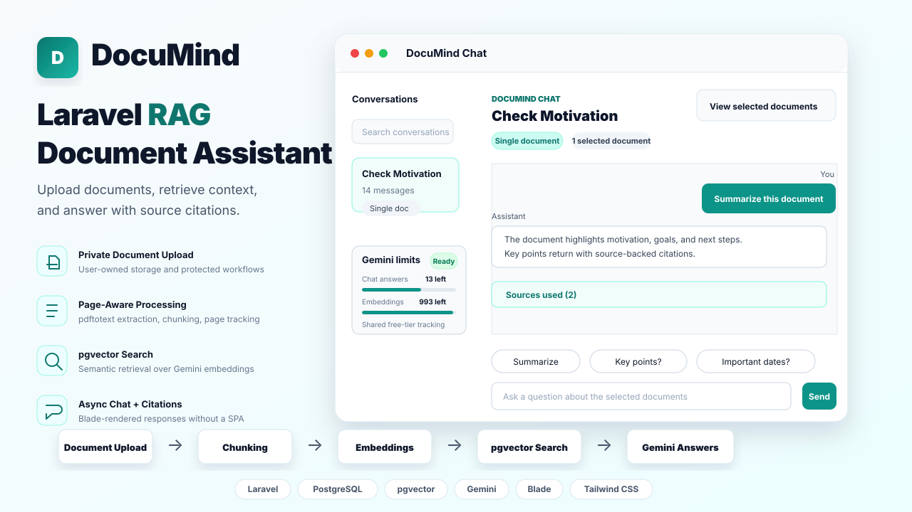

# DocuMind - AI Document Assistant



DocuMind is a full-stack Laravel application for uploading PDF, DOCX, XLSX, and CSV documents, processing them into searchable chunks, storing vector embeddings with PostgreSQL pgvector, and answering document-scoped questions with source citations.

The project is built as a practical Retrieval-Augmented Generation application: users verify their email, upload private documents, wait for background processing, create conversations around one or more documents, and ask questions that are answered only from the selected document context.

## Project Highlights

- Authentication, registration, email verification, password reset, and profile management
- Private document upload flow with per-user document ownership
- Background document processing with queued jobs
- Poppler/pdftotext-based text extraction
- OCR fallback for scanned and image-based PDFs using Tesseract and Poppler `pdftoppm`
- DOCX text extraction using PhpOffice/PHPWord
- XLSX and CSV text extraction using PhpOffice/PhpSpreadsheet
- Page-aware document chunking with `page_start` and `page_end`
- Gemini embedding generation for document chunks
- PostgreSQL pgvector storage and similarity retrieval
- Conversation-centric chat workflow
- Single-document, multi-document, and all-document conversation scopes
- Gemini answer generation using retrieved context
- Citation metadata stored with assistant messages
- App-side Gemini free-tier quota tracking for shared API keys
- Admin console with dashboard metrics, user management, document management, queues, failed jobs, usage logs, usage limits, system health, and global settings
- Account suspension enforcement and admin role controls
- Product usage tracking and per-user/default quota controls
- Global settings for platform switches, upload limits, RAG tuning, AI model options, OCR thresholds, and default user limits
- Live document processing progress with loading indicators
- Non-reloading chat submission with Blade-rendered AJAX responses
- Clean Blade + Tailwind CSS SaaS interface
- Feature and unit test coverage for the core flows

## Tech Stack

**Backend**

- PHP 8.2+
- Laravel 12.x
- Laravel Breeze authentication
- Laravel Queues
- Laravel Notifications for email verification and password resets
- PostgreSQL
- pgvector
- Spatie PDF To Text
- PhpOffice/PHPWord
- PhpOffice/PhpSpreadsheet
- Poppler / `pdftotext` / `pdftoppm`
- Tesseract OCR

**AI and Retrieval**

- Google Gemini Embedding API
- Google Gemini Generate Content API
- Vector similarity search using pgvector cosine distance
- Character-based chunking with page range tracking

**Frontend**

- Blade templates
- Tailwind CSS v4
- Vite
- Minimal JavaScript for AJAX chat UX, quota refreshes, modal handling, loading states, and prompt actions

**Testing**

- PHPUnit
- Laravel feature tests
- Laravel unit tests
- Mocked AI service tests for deterministic test runs

## Core User Flow

1. A user registers and verifies their email.
2. The user uploads a PDF, DOCX, XLSX, or CSV from the document upload page.
3. The document is stored in private Laravel storage.
4. `ProcessDocumentJob` asks `DocumentTextExtractorService` to choose the extractor.
5. Text-based PDFs are extracted with Poppler and checked by `TextExtractionDecisionService`.
6. If needed, scanned PDFs use OCR by converting PDF pages with `pdftoppm` and extracting text with Tesseract.
7. DOCX files are read with PhpOffice/PHPWord.
8. XLSX and CSV files are read with PhpOffice/PhpSpreadsheet.
9. Extracted text is cleaned and split into chunks.
10. Chunks are saved to `document_chunks`.
11. `GenerateDocumentEmbeddingsJob` generates Gemini embeddings for each chunk.
12. Embeddings are stored in PostgreSQL using pgvector.
13. The document becomes `ready`.
14. The user creates a conversation scoped to selected documents or all ready documents.
15. When the user asks a question, the app embeds the question.
16. `RagRetrievalService` retrieves the most relevant chunks from the allowed document scope.
17. `LlmService` asks Gemini to answer using only the retrieved context.
18. The assistant response and citation metadata are saved to the conversation.
19. The chat UI updates the answer, conversation metadata, and Gemini quota card without a full page reload.

## Admin Console

DocuMind includes an admin area at `/admin` for verified users with `is_admin = true`.

Admin sections:

- Dashboard overview with user, document, chunk, conversation, message, queue, storage, file type, and recent activity metrics
- Users list and user detail pages with search, filters, role changes, suspension/activation, usage summaries, latest documents/conversations, and per-user limit editing
- Documents panel with search, filters, safe document metadata, chunk previews, retry, regenerate embeddings, reprocess, and delete actions
- Queue dashboard and failed-job management with retry/forget actions and sanitized exception previews
- Usage logs with filters and sanitized metadata/error detail
- System health page for database, PostgreSQL/pgvector/HNSW, queue tables, storage writability, Gemini config, PDF tools, OCR tools, and latest ready/failed documents
- Settings page for global platform controls, upload limits, RAG settings, AI settings, OCR settings, and default user limits

Admin safety rules:

- Admin routes require authentication, email verification, non-suspended status, and admin access.
- State-changing admin actions use POST, PATCH, or DELETE with CSRF protection.
- The current admin cannot suspend themselves or remove their own admin role.
- Admin screens avoid showing API keys, queue payloads, raw server paths, and full private file paths.

Promote the first admin after creating a user:

```bash
php artisan tinker
```

```php
$user = App\Models\User::where('email', 'admin@example.com')->firstOrFail();
$user->forceFill(['is_admin' => true])->save();
```

Replace `admin@example.com` with an email address that already exists in the `users` table.

## RAG Architecture

```text
Document Upload
   |
   v
Private Storage
   |
   v
ProcessDocumentJob
   |
   +--> DocumentTextExtractorService
   |       - dispatches by MIME type or extension
   |       - keeps OCR limited to PDFs
   |
   +--> PdfExtractorService
   |       - runs pdftotext
   |       - cleans PDF artifacts
   |       - splits text by page
   |
   +--> TextExtractionDecisionService
   |       - checks extracted text quality
   |       - detects empty, image-only, or low-density text
   |
   +--> OcrService
   |       - used only when native text is insufficient
   |       - asks PdfImageConverterService to run pdftoppm
   |       - runs Tesseract OCR per page
   |
   +--> WordExtractorService
   |       - reads DOCX with PHPWord
   |       - extracts paragraphs, headings, and table rows
   |
   +--> ExcelExtractorService
   |       - reads XLSX and CSV with PhpSpreadsheet
   |       - preserves sheet names and row/header metadata
   |
   +--> DocumentChunker
           - creates overlapping chunks
           - tracks PDF page_start/page_end when available
           - keeps spreadsheet sheet and row metadata when available
           - estimates token count
   |
   v
document_chunks
   |
   v
GenerateDocumentEmbeddingsJob
   |
   +--> EmbeddingService
           - calls Gemini embedding API
           - validates 1536 dimensions
           - stores vector in pgvector format
   |
   v
Ready Document
   |
   v
Conversation Question
   |
   +--> GeminiRateLimitService
   |       - checks shared Gemini RPM/TPM/RPD counters
   |       - prevents requests when local app quota is exhausted
   |
   +--> RagRetrievalService
   |       - embeds question
   |       - searches scoped chunks with pgvector
   |
   +--> RagPromptBuilder
   |       - builds grounded context prompt
   |
   +--> LlmService
           - calls Gemini generateContent
           - returns answer and metadata
```

### Live Document Processing Status

DocuMind updates document processing progress in real time using lightweight client-side polling. When a document is uploaded, status badges, counts, timelines, and chat actions update without requiring a full page refresh.

Processing stages include:

- Uploaded
- Text Extracted
- Chunks Created
- Embeddings Stored
- Ready for Chat

The browser polls the authenticated document status endpoint every few seconds while a document is still processing. Polling automatically pauses when the tab is hidden, resumes with an immediate refresh when the tab is visible again, backs off after temporary network errors, and stops when a document reaches a final state: Ready or Failed. This keeps the feature lightweight and production-friendly without requiring WebSockets.

```text
Queue job updates document status in database
   |
   v
Status API endpoint returns latest status
   |
   v
Browser polling updates status badges and timelines
   |
   v
Polling stops when document is Ready or Failed
```

## Main Data Model

### Users

Users own documents and conversations. Email verification is required before accessing protected application pages. Admin and suspension state is stored with `is_admin` and `is_suspended`.

### Documents

Documents represent uploaded PDF, DOCX, XLSX, and CSV files.

Key fields:

- `user_id`
- `ulid`
- `title`
- `description`
- `original_filename`
- `file_path`
- `mime_type`
- `file_size`
- `status`
- `total_pages`
- `total_chunks`
- `processed_at`
- `failed_reason`

Supported statuses:

- `uploaded`
- `processing`
- `text_extracted`
- `chunked`
- `embedded`
- `ready`
- `failed`

### Document Chunks

Chunks store searchable text segments and optional vector embeddings.

Key fields:

- `document_id`
- `chunk_index`
- `page_start`
- `page_end`
- `content`
- `token_count`
- `metadata`
- `embedding`
- `embedded_at`
- `embedding_provider`
- `embedding_model`

### Conversations

Conversations define which documents can be searched during chat.

Supported scopes:

- `selected` - search only attached ready documents
- `all` - search all ready documents owned by the user

### Messages

Messages store user and assistant chat history. Assistant messages include citation metadata in `metadata.sources`.

### Usage Logs

`ai_usage_logs` stores product and AI activity such as document uploads, processing milestones, OCR events, embedding events, chat requests, chat responses, and chat failures. Sensitive metadata and error messages are sanitized before display in admin views.

### User Limits

`user_limits` stores optional per-user quotas for daily chat, daily embeddings, monthly uploads, document count, storage, file size, allowed MIME types, unlimited accounts, and notes. Blank user-limit fields fall back to global default limits.

### App Settings

`app_settings` stores non-secret global settings. It is used for platform controls, upload limits, RAG tuning, AI model names and numeric parameters, OCR thresholds, and default user limits. Secrets such as `GEMINI_API_KEY`, database credentials, and mail credentials remain in `.env`.

## Important Services

- `PdfExtractorService` - extracts and cleans PDF text with page awareness.
- `WordExtractorService` - extracts readable DOCX paragraphs, headings, and table rows with PHPWord.
- `ExcelExtractorService` - extracts XLSX worksheets and CSV rows with header/value relationships and sheet or row metadata.
- `DocumentTextExtractorService` - dispatches extraction by document type and keeps OCR PDF-only.
- `TextExtractionDecisionService` - decides whether native PDF text is sufficient or OCR is required.
- `PdfImageConverterService` - converts PDF pages to temporary PNG images with Poppler `pdftoppm`.
- `OcrService` - runs Tesseract OCR per converted page and preserves page metadata.
- `DocumentChunker` - creates overlapping chunks and maps them to PDF source pages or spreadsheet sheet/row metadata when source data exists.
- `EmbeddingService` - creates Gemini embeddings and validates vector dimensions.
- `GeminiRateLimitService` - tracks shared Gemini request and token limits in cache.
- `RagRetrievalService` - retrieves relevant chunks using pgvector.
- `RagPromptBuilder` - builds concise grounded prompts from retrieved context.
- `LlmService` - generates answers with Gemini using retrieved chunks.
- `UsageTrackingService` - safely records document, embedding, OCR, and chat activity.
- `LimitService` - enforces user and default product quotas.
- `SettingsService` - reads and caches non-secret global admin settings.
- `SystemHealthService` - builds sanitized health-check results for the admin health page.

## Gemini Quota Tracking

The app includes local, project-wide Gemini quota tracking for deployments that use one shared Gemini API key.

Tracked limits:

- Requests per minute (`RPM`)
- Tokens per minute (`TPM`)
- Requests per day (`RPD`)

The quota guard is applied before Gemini embedding and chat calls. If the locally tracked quota is exhausted, the app prevents the next chat request and disables the chat controls until the relevant window resets. The sidebar shows the shared remaining quota for chat answers and embeddings.

This quota is intentionally global for the app, not per user. If multiple users share one Gemini API key, they also share the same local quota counters. This avoids showing each user a fake independent allowance, but it is still first-come-first-served. Add separate per-user quotas if you need fair usage distribution between users.

Important caveat: the app can only track Gemini calls made through this Laravel application. Usage from Google AI Studio, scripts, Postman, or another application using the same API key will not be visible to these local counters, and Gemini may still return a real provider-side `429`.

## Background Jobs

- `ProcessDocumentJob` - extracts document text, falls back to OCR for scanned PDFs when needed, chunks it, stores chunks, and updates document status.
- `GenerateDocumentEmbeddingsJob` - generates embeddings for chunks and marks documents ready.

The jobs are intentionally separated so document processing and API-based embedding generation remain isolated and easier to retry.

## Artisan Commands

```bash
php artisan documents:process {document_id}
php artisan documents:rechunk {document_id}
php artisan documents:rechunk-all
php artisan documents:embed {document_id}
php artisan documents:embed {document_id} --force
php artisan embeddings:test "Your sample text"
php artisan rag:retrieve {conversation_ulid_or_id} "What are the key points?"
php artisan rag:answer {conversation_ulid_or_id} "What actions are required?"
```

These commands are useful for local testing, debugging, and manually reprocessing documents.

## Routes Overview

Public routes:

- `/`
- `/login`
- `/register`
- `/forgot-password`
- `/reset-password/*`

Protected and email-verified routes:

- `/dashboard`
- `/documents`
- `/documents/upload`
- `/documents/{document}`
- `/chat`
- `/chat/{conversation}`
- `/profile`

Admin routes:

- `/admin`
- `/admin/users`
- `/admin/documents`
- `/admin/queues`
- `/admin/failed-jobs`
- `/admin/usage-logs`
- `/admin/system-health`
- `/admin/settings`

Documents and conversations use ULIDs in routes so sequential database IDs are not exposed.

## UI Overview

The interface is designed as a focused SaaS dashboard:

- Landing page for the product overview
- Auth pages styled consistently with the application
- Dashboard with document and question activity
- Upload page for private PDF, DOCX, XLSX, or CSV submission
- Documents list with search, filtering, status badges, and pagination
- Document details page with processing timeline and chunk previews
- Conversation-centric chat page
- Selected document panel and source citation cards
- Collapsed source sections by default so users open citations only when needed
- AJAX message submission that appends answers without reloading the page
- Floating toast notifications for success/error messages
- Sidebar Gemini quota card for shared free-tier usage
- Admin console using the same Blade + Tailwind theme
- Responsive sidebar and mobile navigation

## Security and Authorization

- Authenticated and verified users are required for application routes.
- Uploaded documents are stored in private storage, not public storage.
- DOCX files are read as data through PHPWord and are never executed.
- XLSX and CSV files are read as data through PhpSpreadsheet and are never executed.
- Users can only view and delete their own documents.
- Users can only access their own conversations.
- Retrieval is scoped to the current conversation and current user.
- API keys are read from environment variables and are not exposed in code or logs.
- Password reset and verification emails use Laravel's notification system.
- Suspended users are blocked from normal app and admin routes while still being able to log out and view the suspension notice.
- Admin settings never store secrets; provider keys and infrastructure credentials stay in `.env`.

## Requirements

- PHP 8.2 or newer
- Composer
- Node.js and npm
- PostgreSQL
- pgvector extension enabled
- Poppler installed with `pdftotext` and `pdftoppm` available
- Tesseract OCR installed for scanned PDFs
- PHP extensions needed by DOCX/PHPWord and XLSX/CSV PhpSpreadsheet processing, including `zip`, `xml`, `mbstring`, and usually `gd`
- Gemini API key
- SMTP credentials for email verification and password reset emails

## Docker Development on Windows

The Docker setup is additive: the existing XAMPP configuration and Windows binary paths remain unchanged. Docker uses its own PostgreSQL data, Composer dependencies, and Node dependencies in named volumes. The application is available at `http://localhost:8080`, while the Docker PostgreSQL port is exposed on `127.0.0.1:5433` by default to avoid colliding with a PostgreSQL instance already running on Windows.

### Install Docker Desktop

1. Install Docker Desktop for Windows and enable the WSL 2 backend when prompted.
2. Start Docker Desktop and wait until the Docker engine is running.
3. From PowerShell in the project directory, verify the installation:

```powershell
docker version
docker compose version
```

Keeping the repository inside the WSL filesystem usually gives the best bind-mount performance, but the stack also works from a Windows path such as an XAMPP `htdocs` directory.

### Create the Docker environment file

Docker Compose reads the project `.env`. For a fresh clone, copy the Docker template:

```powershell
Copy-Item .env.docker.example .env
```

If `.env` already contains working XAMPP settings, preserve it before switching environments. No Docker file or command in this project overwrites it automatically:

```powershell
Copy-Item .env .env.backup
Copy-Item .env.docker.example .env
```

Add your `GEMINI_API_KEY` and any local mail settings to `.env`. To return to XAMPP later, restore the backup with `Copy-Item .env.backup .env`.

The Docker template uses the internal service values `DB_HOST=postgres` and `DB_PORT=5432`. Do not change `DB_PORT` to the host-facing `FORWARD_DB_PORT`; containers communicate over the Docker network.

### Build and start the stack

Build the shared PHP image, then start PHP-FPM, Nginx, PostgreSQL with pgvector, and the queue worker:

```powershell
docker compose build
docker compose up -d
```

Install PHP dependencies into the Docker-only Composer volume and generate the application key:

```powershell
docker compose exec app composer install
docker compose exec app php artisan key:generate
```

Install frontend dependencies and create a production asset build. The Node dependencies are also kept in a Docker-only named volume:

```powershell
docker compose run --rm node npm install
docker compose run --rm node npm run build
```

Run the database migrations after Composer dependencies are installed:

```powershell
docker compose exec app php artisan migrate
```

Open `http://localhost:8080`. You can inspect service state and logs with:

```powershell
docker compose ps
docker compose logs -f app nginx queue postgres
```

### Optional Vite development server

The `node` service is behind the optional `frontend` profile, so it does not run during a normal `docker compose up -d`. Start Vite with filesystem polling for Windows bind mounts using:

```powershell
docker compose --profile frontend up -d node
docker compose logs -f node
```

Stop only the development server with `docker compose stop node`. For a static frontend instead, rerun `docker compose run --rm node npm run build`.

### Queue worker commands

The queue worker starts with the default stack and waits until `composer install` has created `vendor/autoload.php`. Start it separately or recreate it with:

```powershell
docker compose up -d queue
docker compose restart queue
```

To request Laravel's normal graceful worker restart after code or settings changes, run:

```powershell
docker compose exec app php artisan queue:restart
```

The worker container has `restart: unless-stopped`, so Docker starts a fresh worker after the graceful exit.

### Verify Poppler, Tesseract, and pgvector

Check the PDF and OCR binaries inside the PHP container:

```powershell
docker compose exec app pdftotext -v
docker compose exec app pdftoppm -v
docker compose exec app tesseract --version
docker compose exec app tesseract --list-langs
```

The image installs English OCR data (`tesseract-ocr-eng`), matching `OCR_LANGUAGE=eng`. Confirm pgvector was initialized in PostgreSQL with:

```powershell
docker compose exec postgres psql -U documind -d documind -c 'SELECT extversion FROM pg_extension WHERE extname = ''vector'';'
```

Run the Laravel tests in the PHP container with `docker compose exec app php artisan test`. Stop the stack without deleting database or dependency volumes using `docker compose down`.

## Installation

Clone the repository and install dependencies:

```bash
composer install
npm install
```

Create your environment file:

```bash
cp .env.example .env
php artisan key:generate
```

Configure PostgreSQL in `.env`:

```env
DB_CONNECTION=pgsql
DB_HOST=127.0.0.1
DB_PORT=5432
DB_DATABASE=your_database
DB_USERNAME=your_username
DB_PASSWORD=your_password
```

Enable pgvector in PostgreSQL:

```sql
CREATE EXTENSION IF NOT EXISTS vector;
```

Run migrations:

```bash
php artisan migrate
```

Promote an existing verified user to the first admin:

```bash
php artisan tinker
```

```php
$user = App\Models\User::where('email', 'admin@example.com')->firstOrFail();
$user->forceFill(['is_admin' => true])->save();
```

Build frontend assets:

```bash
npm run dev
```

Start the Laravel server:

```bash
php artisan serve
```

Start the queue worker in a separate terminal:

```bash
php artisan queue:work
```

## Environment Variables

AI and RAG configuration:

```env
PDFTOTEXT_PATH=
PDFTOPPM_PATH=
OCR_ENABLED=true
OCR_LANGUAGE=eng
OCR_MIN_TEXT_CHARACTERS=20
OCR_MIN_TEXT_DENSITY_PER_PAGE=10
OCR_PDF_DPI=200
PDFTOPPM_TIMEOUT=300
TESSERACT_PATH=
TESSERACT_TIMEOUT=120
EMBEDDING_PROVIDER=gemini
LLM_PROVIDER=gemini
GEMINI_API_KEY=
GEMINI_EMBEDDING_MODEL=gemini-embedding-2
GEMINI_CHAT_MODEL=gemini-2.5-flash
EMBEDDING_DIMENSIONS=1536
GEMINI_RATE_LIMITS_ENABLED=true
GEMINI_RATE_LIMIT_PROJECT="${APP_NAME}"
GEMINI_2_5_FLASH_RPM=5
GEMINI_2_5_FLASH_TPM=250000
GEMINI_2_5_FLASH_RPD=20
GEMINI_EMBEDDING_2_RPM=100
GEMINI_EMBEDDING_2_TPM=30000
GEMINI_EMBEDDING_2_RPD=1000
LLM_TEMPERATURE=0.2
LLM_MAX_OUTPUT_TOKENS=3000
LLM_CONTINUATION_ATTEMPTS=1
RAG_TOP_K=6
RAG_SUMMARY_TOP_K=12
RAG_MAX_CONTEXT_CHARS=24000
RAG_RETRIEVAL_MAX_DISTANCE=
RAG_MESSAGE_RATE_LIMIT_PER_MINUTE=20
```

Many non-secret values above can also be adjusted from `/admin/settings` after deployment. Environment values remain the fallback defaults and are still the only place for secrets such as `GEMINI_API_KEY`.

Mail configuration example:

```env
MAIL_MAILER=smtp
MAIL_HOST=smtp.gmail.com
MAIL_PORT=587
MAIL_USERNAME=your_email@example.com
MAIL_PASSWORD=your_app_password
MAIL_ENCRYPTION=tls
MAIL_FROM_ADDRESS=your_email@example.com
MAIL_FROM_NAME="${APP_NAME}"
```

If `PDFTOTEXT_PATH`, `PDFTOPPM_PATH`, or `TESSERACT_PATH` is empty, the app resolves the binary from the system path. On Windows/XAMPP, setting explicit `.exe` paths is usually more reliable.

For DOCX and XLSX/CSV extraction, make sure the PHP `zip`, `xml`, `mbstring`, and usually `gd` extensions are enabled. On Windows/XAMPP, enable them in `php.ini` if needed, then restart Apache and the Laravel queue worker. Excel and CSV support does not require extra Windows software like Poppler or Tesseract; those binaries are only needed for PDF extraction and scanned PDF OCR.

See [Linux Deployment Guide](docs/linux-deployment-guide.md) for production server setup, including PostgreSQL, pgvector, Poppler, Tesseract OCR, queues, and Nginx.

The Gemini rate-limit defaults above match the free-tier limits used by this project during development. Check your Gemini dashboard and update these values if Google changes your project limits or if you switch to a paid tier.

## Testing the Full Flow

1. Register a user.
2. Verify the email address.
3. Start the queue worker:

```bash
php artisan queue:work
```

4. Upload a text-based PDF, scanned PDF, DOCX, XLSX, or CSV.
5. Wait until the document status becomes `Ready`.
6. Open DocuMind Chat.
7. Create a conversation with one or more ready documents.
8. Ask a question related to the selected document content.
9. Confirm the assistant response includes source citation cards.
10. Promote an admin user and open `/admin`.
11. Check `/admin/system-health`.
12. Review `/admin/settings`, then save once to seed editable setting rows if desired.

Live status checklist:

- Upload PDF, scanned PDF, DOCX, XLSX, and CSV files and watch status update without a full page reload.
- Confirm document detail, document cards, dashboard recent documents, and the chat document selector update live.
- Confirm processing documents show spinners and ready documents enable chat actions or selector checkboxes.
- Confirm failed documents show the failed badge and failure reason when available.
- Confirm polling stops after Ready or Failed.
- Confirm hidden browser tabs pause polling and refresh when visible again.
- Confirm duplicate UI instances of the same document do not create duplicate status requests.
- Confirm pages still render correctly if JavaScript is disabled or fails.

Admin checklist:

- Confirm non-admin users cannot access `/admin`.
- Confirm an admin can search/filter users and documents.
- Confirm an admin cannot suspend their own account or remove their own admin role.
- Confirm failed job views do not show queue payloads, secrets, or raw stack traces.
- Confirm `/admin/settings` can disable uploads, chat, or registration and that users see friendly validation messages.
- Confirm `/admin/system-health` reports database, pgvector, queue, storage, Gemini, PDF, and OCR status without showing API keys or private paths.

## Testing Commands

Run the automated test suite:

```bash
php artisan test
```

Test embeddings without printing the full vector:

```bash
php artisan embeddings:test "Summarize the contract renewal terms."
```

Test retrieval without generating an answer:

```bash
php artisan rag:retrieve {conversation_ulid_or_id} "What are the important deadlines?"
```

Test retrieval and answer generation from the terminal:

```bash
php artisan rag:answer {conversation_ulid_or_id} "What actions are required?"
```

## How to Confirm Embeddings Are Stored

Use a database client or `psql`:

```sql
SELECT
    id,
    document_id,
    chunk_index,
    embedded_at,
    embedding_provider,
    embedding_model,
    embedding IS NOT NULL AS has_embedding
FROM document_chunks
ORDER BY id DESC
LIMIT 10;
```

## Known Limitations

- Text-based PDFs, DOCX, XLSX, and CSV files are faster because OCR is skipped when native extraction is sufficient.
- OCR quality depends on scan resolution, document language, rotation, and Tesseract language data.
- Tables, charts, and graph-heavy PDFs may lose structure during text extraction.
- DOCX page numbers are not reliable during server-side extraction, so Word citations use the document source rather than page numbers.
- XLSX and CSV citations may use sheet and row metadata instead of page numbers.
- Charts and images inside Excel files are not extracted.
- Complex merged cells may lose some visual layout.
- Formula results are extracted as readable values where possible.
- Legacy `.doc` and `.xls` files are not supported yet; upload PDF, DOCX, XLSX, or CSV.
- Retrieval quality depends on extracted text quality and chunk boundaries.
- Streaming responses are not implemented.
- Gemini quota tracking is local to this Laravel app and cannot see API-key usage from outside the app.
- Shared Gemini quota is global and first-come-first-served; per-user quota distribution is not implemented.
- Multi-turn memory optimization is intentionally kept simple for the MVP.
- Changing embedding model dimensions after embeddings already exist requires a planned database/vector re-embedding workflow.
- Global settings are cached; long-running queue workers may need a restart after settings changes that affect processing behavior.

## Future Improvements

- Streaming chat responses
- Per-user quota allocation on top of the shared Gemini project quota
- Organization/team workspaces
- Conversation renaming and document scope editing
- Advanced retrieval reranking
- Better table-aware parsing
- Richer admin reporting and export tools
- Deployment pipeline and CI workflow

## Why This Project Matters

This project demonstrates a complete modern Laravel AI workflow:

- Secure user authentication
- File upload and private storage
- Queue-based backend processing
- PostgreSQL relational modeling
- pgvector-based semantic retrieval
- External AI API integration
- Clean Blade/Tailwind UI implementation
- Authorization and ownership boundaries
- Testable service-oriented architecture

It is designed as a practical showcase of how Laravel can be used to build production-style AI applications without relying on a JavaScript SPA framework.
