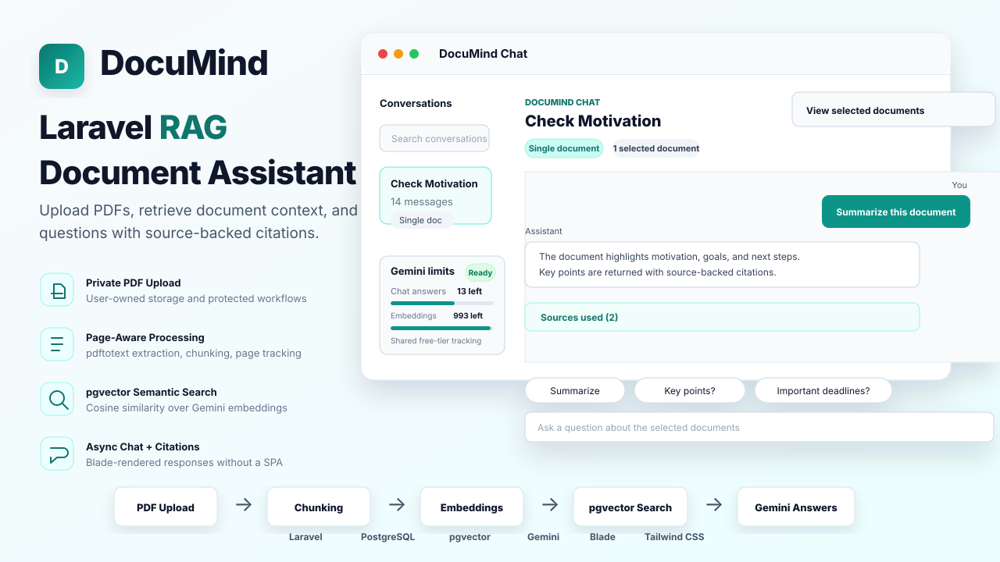

# DocuMind - AI PDF Document Assistant



DocuMind is a full-stack Laravel application for uploading PDFs, processing them into searchable chunks, storing vector embeddings with PostgreSQL pgvector, and answering document-scoped questions with source citations.

The project is built as a practical Retrieval-Augmented Generation application: users verify their email, upload private PDFs, wait for background processing, create conversations around one or more documents, and ask questions that are answered only from the selected document context.

## Project Highlights

- Authentication, registration, email verification, password reset, and profile management
- Private PDF upload flow with per-user document ownership
- Background PDF processing with queued jobs
- Poppler/pdftotext-based text extraction
- Page-aware document chunking with `page_start` and `page_end`
- Gemini embedding generation for document chunks
- PostgreSQL pgvector storage and similarity retrieval
- Conversation-centric chat workflow
- Single-document, multi-document, and all-document conversation scopes
- Gemini answer generation using retrieved context
- Citation metadata stored with assistant messages
- App-side Gemini free-tier quota tracking for shared API keys
- Non-reloading chat submission with Blade-rendered AJAX responses
- Clean Blade + Tailwind CSS SaaS interface
- Feature and unit test coverage for the core flows

## Tech Stack

**Backend**

- PHP 8.2+
- Laravel 12.x
- Laravel Breeze authentication
- Laravel Queues
- Laravel Notifications for email verification and password resets
- PostgreSQL
- pgvector
- Spatie PDF To Text
- Poppler / `pdftotext`

**AI and Retrieval**

- Google Gemini Embedding API
- Google Gemini Generate Content API
- Vector similarity search using pgvector cosine distance
- Character-based chunking with page range tracking

**Frontend**

- Blade templates
- Tailwind CSS v4
- Vite
- Minimal JavaScript for AJAX chat UX, quota refreshes, modal handling, loading states, and prompt actions

**Testing**

- PHPUnit
- Laravel feature tests
- Laravel unit tests
- Mocked AI service tests for deterministic test runs

## Core User Flow

1. A user registers and verifies their email.
2. The user uploads a PDF from the document upload page.
3. The PDF is stored in private Laravel storage.
4. `ProcessDocumentJob` extracts text from the PDF using Poppler.
5. Extracted text is cleaned and split into page-aware chunks.
6. Chunks are saved to `document_chunks`.
7. `GenerateDocumentEmbeddingsJob` generates Gemini embeddings for each chunk.
8. Embeddings are stored in PostgreSQL using pgvector.
9. The document becomes `ready`.
10. The user creates a conversation scoped to selected documents or all ready documents.
11. When the user asks a question, the app embeds the question.
12. `RagRetrievalService` retrieves the most relevant chunks from the allowed document scope.
13. `LlmService` asks Gemini to answer using only the retrieved context.
14. The assistant response and citation metadata are saved to the conversation.
15. The chat UI updates the answer, conversation metadata, and Gemini quota card without a full page reload.

## RAG Architecture

```text
PDF Upload
   |
   v
Private Storage
   |
   v
ProcessDocumentJob
   |
   +--> PdfExtractorService
   |       - runs pdftotext
   |       - cleans PDF artifacts
   |       - splits text by page
   |
   +--> DocumentChunker
           - creates overlapping chunks
           - tracks page_start/page_end
           - estimates token count
   |
   v
document_chunks
   |
   v
GenerateDocumentEmbeddingsJob
   |
   +--> EmbeddingService
           - calls Gemini embedding API
           - validates 1536 dimensions
           - stores vector in pgvector format
   |
   v
Ready Document
   |
   v
Conversation Question
   |
   +--> GeminiRateLimitService
   |       - checks shared Gemini RPM/TPM/RPD counters
   |       - prevents requests when local app quota is exhausted
   |
   +--> RagRetrievalService
   |       - embeds question
   |       - searches scoped chunks with pgvector
   |
   +--> RagPromptBuilder
   |       - builds grounded context prompt
   |
   +--> LlmService
           - calls Gemini generateContent
           - returns answer and metadata
```

## Main Data Model

### Users

Users own documents and conversations. Email verification is required before accessing protected application pages.

### Documents

Documents represent uploaded PDFs.

Key fields:

- `user_id`
- `ulid`
- `title`
- `description`
- `original_filename`
- `file_path`
- `mime_type`
- `file_size`
- `status`
- `total_pages`
- `total_chunks`
- `processed_at`
- `failed_reason`

Supported statuses:

- `uploaded`
- `processing`
- `text_extracted`
- `chunked`
- `embedded`
- `ready`
- `failed`

### Document Chunks

Chunks store searchable text segments and optional vector embeddings.

Key fields:

- `document_id`
- `chunk_index`
- `page_start`
- `page_end`
- `content`
- `token_count`
- `metadata`
- `embedding`
- `embedded_at`
- `embedding_provider`
- `embedding_model`

### Conversations

Conversations define which documents can be searched during chat.

Supported scopes:

- `selected` - search only attached ready documents
- `all` - search all ready documents owned by the user

### Messages

Messages store user and assistant chat history. Assistant messages include citation metadata in `metadata.sources`.

## Important Services

- `PdfExtractorService` - extracts and cleans PDF text with page awareness.
- `DocumentChunker` - creates overlapping chunks and maps them to source pages.
- `EmbeddingService` - creates Gemini embeddings and validates vector dimensions.
- `GeminiRateLimitService` - tracks shared Gemini request and token limits in cache.
- `RagRetrievalService` - retrieves relevant chunks using pgvector.
- `RagPromptBuilder` - builds concise grounded prompts from retrieved context.
- `LlmService` - generates answers with Gemini using retrieved chunks.

## Gemini Quota Tracking

The app includes local, project-wide Gemini quota tracking for deployments that use one shared Gemini API key.

Tracked limits:

- Requests per minute (`RPM`)
- Tokens per minute (`TPM`)
- Requests per day (`RPD`)

The quota guard is applied before Gemini embedding and chat calls. If the locally tracked quota is exhausted, the app prevents the next chat request and disables the chat controls until the relevant window resets. The sidebar shows the shared remaining quota for chat answers and embeddings.

This quota is intentionally global for the app, not per user. If multiple users share one Gemini API key, they also share the same local quota counters. This avoids showing each user a fake independent allowance, but it is still first-come-first-served. Add separate per-user quotas if you need fair usage distribution between users.

Important caveat: the app can only track Gemini calls made through this Laravel application. Usage from Google AI Studio, scripts, Postman, or another application using the same API key will not be visible to these local counters, and Gemini may still return a real provider-side `429`.

## Background Jobs

- `ProcessDocumentJob` - extracts PDF text, chunks it, stores chunks, and updates document status.
- `GenerateDocumentEmbeddingsJob` - generates embeddings for chunks and marks documents ready.

The jobs are intentionally separated so PDF processing and API-based embedding generation remain isolated and easier to retry.

## Artisan Commands

```bash
php artisan documents:process {document_id}
php artisan documents:rechunk {document_id}
php artisan documents:rechunk-all
php artisan documents:embed {document_id}
php artisan documents:embed {document_id} --force
php artisan embeddings:test "Your sample text"
php artisan rag:retrieve {conversation_ulid_or_id} "What are the key points?"
php artisan rag:answer {conversation_ulid_or_id} "What actions are required?"
```

These commands are useful for local testing, debugging, and manually reprocessing documents.

## Routes Overview

Public routes:

- `/`
- `/login`
- `/register`
- `/forgot-password`
- `/reset-password/*`

Protected and email-verified routes:

- `/dashboard`
- `/documents`
- `/documents/upload`
- `/documents/{document}`
- `/chat`
- `/chat/{conversation}`
- `/profile`

Documents and conversations use ULIDs in routes so sequential database IDs are not exposed.

## UI Overview

The interface is designed as a focused SaaS dashboard:

- Landing page for the product overview
- Auth pages styled consistently with the application
- Dashboard with document and question activity
- Upload page for private PDF submission
- Documents list with search, filtering, status badges, and pagination
- Document details page with processing timeline and chunk previews
- Conversation-centric chat page
- Selected document panel and source citation cards
- Collapsed source sections by default so users open citations only when needed
- AJAX message submission that appends answers without reloading the page
- Floating toast notifications for success/error messages
- Sidebar Gemini quota card for shared free-tier usage
- Responsive sidebar and mobile navigation

## Security and Authorization

- Authenticated and verified users are required for application routes.
- PDFs are stored in private storage, not public storage.
- Users can only view and delete their own documents.
- Users can only access their own conversations.
- Retrieval is scoped to the current conversation and current user.
- API keys are read from environment variables and are not exposed in code or logs.
- Password reset and verification emails use Laravel's notification system.

## Requirements

- PHP 8.2 or newer
- Composer
- Node.js and npm
- PostgreSQL
- pgvector extension enabled
- Poppler installed with `pdftotext` available
- Gemini API key
- SMTP credentials for email verification and password reset emails

## Installation

Clone the repository and install dependencies:

```bash
composer install
npm install
```

Create your environment file:

```bash
cp .env.example .env
php artisan key:generate
```

Configure PostgreSQL in `.env`:

```env
DB_CONNECTION=pgsql
DB_HOST=127.0.0.1
DB_PORT=5432
DB_DATABASE=your_database
DB_USERNAME=your_username
DB_PASSWORD=your_password
```

Enable pgvector in PostgreSQL:

```sql
CREATE EXTENSION IF NOT EXISTS vector;
```

Run migrations:

```bash
php artisan migrate
```

Build frontend assets:

```bash
npm run dev
```

Start the Laravel server:

```bash
php artisan serve
```

Start the queue worker in a separate terminal:

```bash
php artisan queue:work
```

## Environment Variables

AI and RAG configuration:

```env
PDFTOTEXT_PATH=
EMBEDDING_PROVIDER=gemini
LLM_PROVIDER=gemini
GEMINI_API_KEY=
GEMINI_EMBEDDING_MODEL=gemini-embedding-2
GEMINI_CHAT_MODEL=gemini-2.5-flash
EMBEDDING_DIMENSIONS=1536
GEMINI_RATE_LIMITS_ENABLED=true
GEMINI_RATE_LIMIT_PROJECT="${APP_NAME}"
GEMINI_2_5_FLASH_RPM=5
GEMINI_2_5_FLASH_TPM=250000
GEMINI_2_5_FLASH_RPD=20
GEMINI_EMBEDDING_2_RPM=100
GEMINI_EMBEDDING_2_TPM=30000
GEMINI_EMBEDDING_2_RPD=1000
LLM_TEMPERATURE=0.2
LLM_MAX_OUTPUT_TOKENS=3000
LLM_CONTINUATION_ATTEMPTS=1
RAG_TOP_K=6
RAG_SUMMARY_TOP_K=12
RAG_MAX_CONTEXT_CHARS=24000
RAG_RETRIEVAL_MAX_DISTANCE=
RAG_MESSAGE_RATE_LIMIT_PER_MINUTE=20
```

Mail configuration example:

```env
MAIL_MAILER=smtp
MAIL_HOST=smtp.gmail.com
MAIL_PORT=587
MAIL_USERNAME=your_email@example.com
MAIL_PASSWORD=your_app_password
MAIL_ENCRYPTION=tls
MAIL_FROM_ADDRESS=your_email@example.com
MAIL_FROM_NAME="${APP_NAME}"
```

If `PDFTOTEXT_PATH` is empty, the app lets Spatie/Poppler resolve `pdftotext` from the system path.

The Gemini rate-limit defaults above match the free-tier limits used by this project during development. Check your Gemini dashboard and update these values if Google changes your project limits or if you switch to a paid tier.

## Testing the Full Flow

1. Register a user.
2. Verify the email address.
3. Start the queue worker:

```bash
php artisan queue:work
```

4. Upload a text-based PDF.
5. Wait until the document status becomes `Ready`.
6. Open DocuMind Chat.
7. Create a conversation with one or more ready documents.
8. Ask a question related to the selected document content.
9. Confirm the assistant response includes source citation cards.

## Testing Commands

Run the automated test suite:

```bash
php artisan test
```

Test embeddings without printing the full vector:

```bash
php artisan embeddings:test "Summarize the contract renewal terms."
```

Test retrieval without generating an answer:

```bash
php artisan rag:retrieve {conversation_ulid_or_id} "What are the important deadlines?"
```

Test retrieval and answer generation from the terminal:

```bash
php artisan rag:answer {conversation_ulid_or_id} "What actions are required?"
```

## How to Confirm Embeddings Are Stored

Use a database client or `psql`:

```sql
SELECT
    id,
    document_id,
    chunk_index,
    embedded_at,
    embedding_provider,
    embedding_model,
    embedding IS NOT NULL AS has_embedding
FROM document_chunks
ORDER BY id DESC
LIMIT 10;
```

## Known Limitations

- Text-based PDFs work best.
- Scanned PDFs require OCR, which is not implemented.
- Tables, charts, and graph-heavy PDFs may lose structure during text extraction.
- Retrieval quality depends on extracted text quality and chunk boundaries.
- Streaming responses are not implemented.
- Gemini quota tracking is local to this Laravel app and cannot see API-key usage from outside the app.
- Shared Gemini quota is global and first-come-first-served; per-user quota distribution is not implemented.
- Multi-turn memory optimization is intentionally kept simple for the MVP.

## Future Improvements

- OCR support for scanned PDFs
- Streaming chat responses
- Per-user quota allocation on top of the shared Gemini project quota
- Organization/team workspaces
- Conversation renaming and document scope editing
- Advanced retrieval reranking
- Better table-aware parsing
- Usage analytics and admin dashboards
- Deployment pipeline and CI workflow

## Why This Project Matters

This project demonstrates a complete modern Laravel AI workflow:

- Secure user authentication
- File upload and private storage
- Queue-based backend processing
- PostgreSQL relational modeling
- pgvector-based semantic retrieval
- External AI API integration
- Clean Blade/Tailwind UI implementation
- Authorization and ownership boundaries
- Testable service-oriented architecture

It is designed as a practical showcase of how Laravel can be used to build production-style AI applications without relying on a JavaScript SPA framework.
